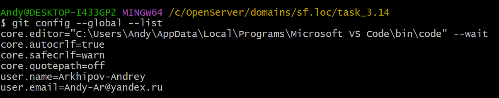

# ИНСТРУКЦИЯ ПО РАБОТЕ С GIT


---

[<<](install-git.md) | [Содержание](../readme.md) -> Конфигурирование GIT | [>>](init-git.md)

---

## Конфигурирование GIT

### Отображение настроек (конфигурационного файла)

```
git config --list
git config --global -- list
```



### Настройка имени автора и его emeil

```
git config --global user.name "User-Name"
git config --global user.email "Email@mail.com"
```

### Параметры окончания строк

```
git config --global core.autocrlf true
git config --global core.safecrls warn
```

### Установка отображения unicode

```
git config --global core.quotepath off
```

---

Copyright 2022 Arkhipov Andrey

> Licensed under the Apache License, Version 2.0 (the "License");
> You may not use this file except in compliance with the License.
> You may obtain a copy of the License at
> [http://www.apache.org/licenses/LICENSE-2.0](http://www.apache.org/licenses/LICENSE-2.0)
> Unless required by applicable law or agreed to in writing, software distributed under the License is distributed on an "AS IS" BASIS, WITHOUT WARRANTIES OR CONDITIONS OF ANY KIND, either express or implied.
> See the License for the specific language governing permissions and limitations under the License.

---

Git Logo by Jason Long - [https://git-scm.com/downloads/logos,](https://git-scm.com/downloads/logos)

> licensed under the [Creative Commons Attribution 3.0 Unported License.](https://creativecommons.org/licenses/by/3.0/)

---
