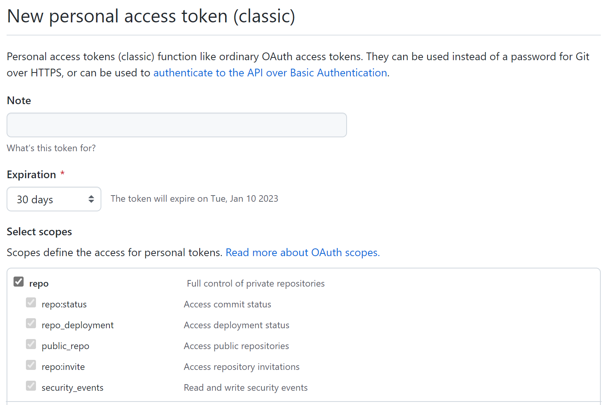
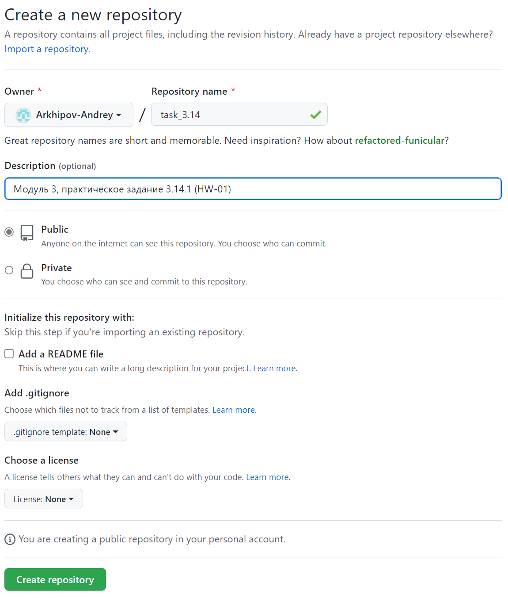

# ИНСТРУКЦИЯ ПО РАБОТЕ С GIT

---

[<<](merge-git.md) | [Содержание](../readme.md) -> github.com | [>>](remote-git.md)

---

## GITHUB.COM

### Ссылка для регистрации на GITHUB:

[https://github.com](https://github.com)

### Генерация токена для для доступа к github.com

Для генерации токена необходимо пройти по ссылкам: **Settings->Developer Settings->Personal accses Tokens->Tokens (classic)->Generate new token->Generate new token (classic)**

> _Необходим для операций с удаленным репозиторием через протокол https_

> _Заполнить примечание, срок действия и выбрать права доступа (чекбокс - repo)_

### Создание репозитория

> _Ссылка на созданный репозиторий https://github.com/Arkhipov-Andrey/task_3.14.git_

---

Copyright 2022 Arkhipov Andrey

> Licensed under the Apache License, Version 2.0 (the "License");
> You may not use this file except in compliance with the License.
> You may obtain a copy of the License at
> [http://www.apache.org/licenses/LICENSE-2.0](http://www.apache.org/licenses/LICENSE-2.0)
> Unless required by applicable law or agreed to in writing, software distributed under the License is distributed on an "AS IS" BASIS, WITHOUT WARRANTIES OR CONDITIONS OF ANY KIND, either express or implied.
> See the License for the specific language governing permissions and limitations under the License.

---

Git Logo by Jason Long - [https://git-scm.com/downloads/logos,](https://git-scm.com/downloads/logos)

> licensed under the [Creative Commons Attribution 3.0 Unported License.](https://creativecommons.org/licenses/by/3.0/)

---
