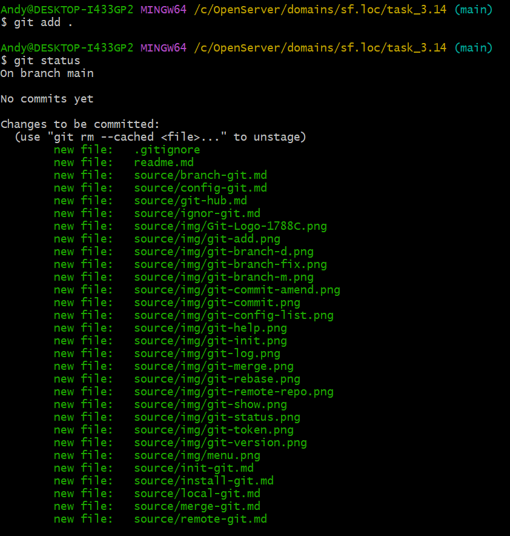
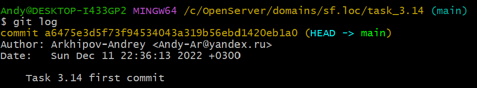

# ИНСТРУКЦИЯ ПО РАБОТЕ С GIT


---

[<<](ignor-git.md) | [Содержание](../readme.md) -> Работа с локальным репозиторием | [>>](branch-git.md)

---

## Работа с локальным репозиторием

### Просмотр текущего состояния репозитория

```
git status
```


> _Наличие модифицированных/немодифицированных, неотслеживаемых и подготовленных файлов_

> _Файл task.txt игнорируется в соответствии с правилами прописанными в .gitignore_

### Добавление файла/файлов (изменений) в ИНДЕКС из РАБОЧЕЙ ДИРЕКТОРИИ

```
git add log.txt
git add .
git add -a
```



### Сохранение изменений из ИНДЕКСА в ЛОКАЛЬНЫЙ РЕПОЗИТОРИЙ (Сохранение версии/состояния проекта)

```
git commit -m "Комментарий"
git commit (Комментарий добавить в редакторе)
```


### Корректировка комментария к созданному коммиту

```
git commit --amend -m "Новый коммментарий"
```


### Просмотр версий/коммитов

```
git log
```



### Подробная информацию об объекте

```
git show
```


### Переход/возвращение на определенную версию (Из РЕПОЗИТОРИЯ в РАБОЧУЮ ДИРЕКТОРИЮ)

```
git checkout 7c901d1c9167499367f1d16fb005243ac269adf2
```


> _Указать хэш коммита на который необходимо перейти_

---

Copyright 2022 Arkhipov Andrey

> Licensed under the Apache License, Version 2.0 (the "License");
> You may not use this file except in compliance with the License.
> You may obtain a copy of the License at
> [http://www.apache.org/licenses/LICENSE-2.0](http://www.apache.org/licenses/LICENSE-2.0)
> Unless required by applicable law or agreed to in writing, software distributed under the License is distributed on an "AS IS" BASIS, WITHOUT WARRANTIES OR CONDITIONS OF ANY KIND, either express or implied.
> See the License for the specific language governing permissions and limitations under the License.

---

Git Logo by Jason Long - [https://git-scm.com/downloads/logos,](https://git-scm.com/downloads/logos)

> licensed under the [Creative Commons Attribution 3.0 Unported License.](https://creativecommons.org/licenses/by/3.0/)

---
