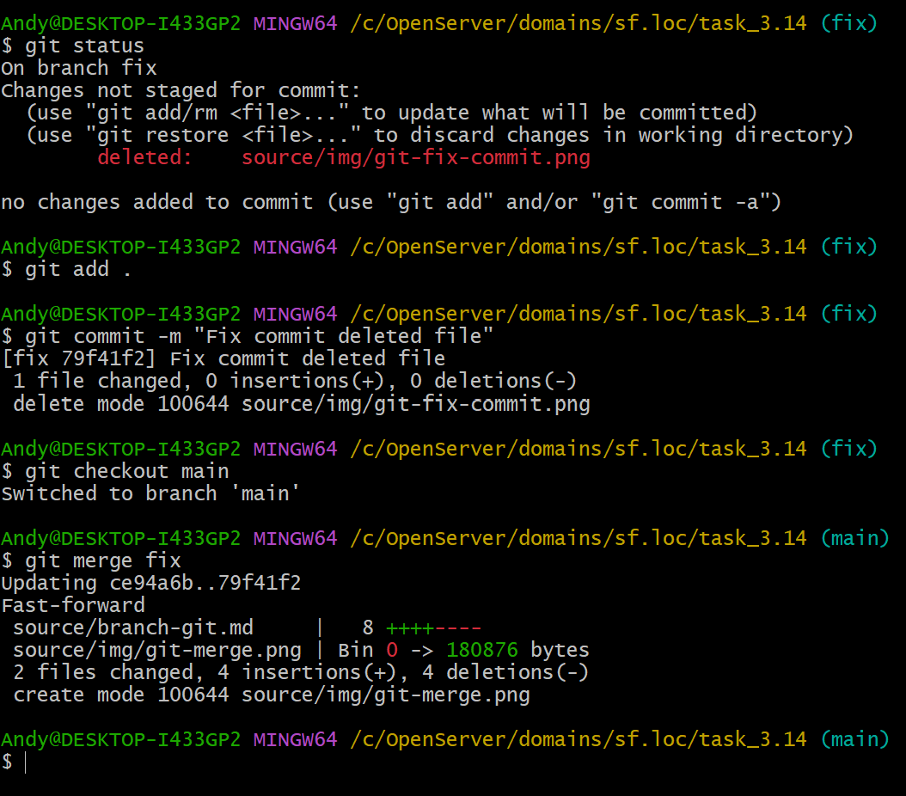
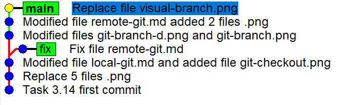
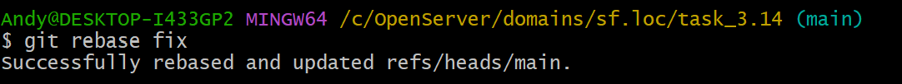

# ИНСТРУКЦИЯ ПО РАБОТЕ С GIT


---

[<<](branch-git.md) | [Содержание](../readme.md) -> Слияние веток в GIT | [>>](git-hub.md)

---

## Слияние веток в GIT

### Слияние веток

```
git merge fix
```



> _Слияние текущей ветки main с веткой fix_




### Перебазирование коммитов одной ветки на другую

```
git rebase fix
```



---

Copyright 2022 Arkhipov Andrey

> Licensed under the Apache License, Version 2.0 (the "License");
> You may not use this file except in compliance with the License.
> You may obtain a copy of the License at
> [http://www.apache.org/licenses/LICENSE-2.0](http://www.apache.org/licenses/LICENSE-2.0)
> Unless required by applicable law or agreed to in writing, software distributed under the License is distributed on an "AS IS" BASIS, WITHOUT WARRANTIES OR CONDITIONS OF ANY KIND, either express or implied.
> See the License for the specific language governing permissions and limitations under the License.

---

Git Logo by Jason Long - [https://git-scm.com/downloads/logos,](https://git-scm.com/downloads/logos)

> licensed under the [Creative Commons Attribution 3.0 Unported License.](https://creativecommons.org/licenses/by/3.0/)

---
