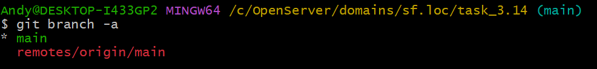

# ИНСТРУКЦИЯ ПО РАБОТЕ С GIT


---

[<<](git-hub.md) | [Содержание](../readme.md) -> Работа с удаленным репозиторием | [>>](../readme.md)

---

## Работа с удаленным репозиторием

### Добавить связь с удаленным репозиторием

```
git remote add origin https://github.com/Arkhipov-Andrey/task_3.14.git
```


> _origin - удаленный репозиторий, upstream - удаленный репозиторий с которого сделан fork_

### Клонирование репозитория с github.com

```
git clone https://github.com/Arkhipov-Andrey/task_3.14.git
```


### Отобразить связи с удаленным репозиторием

```
git remote -v
```


### Отобразить все существующие ветки в текущем репозитории (включая удаленные)

```
git branch -a
```



### Отобразить связи веток локального репозитория с ветками удаленного репозитория

```
git branch -vv
```


### Получить перечень изменений из удаленного репозитория

```
git fetch
```

### Получить последнюю редакцию из удаленного репозитория

```
git pull
```


> _Обновляются файлы в РАБОЧЕЙ ДИРЕКТОРИИ_

### Получить последнюю редакцию ветки main из удаленного репозитория origin

```
git pull origin main
```

> _origin - название репозитория, main - название ветки_

### Обновить удаленный репозиторий

```
git push
git push -u origin main
```


Copyright 2022 Arkhipov Andrey

> Licensed under the Apache License, Version 2.0 (the "License");
> You may not use this file except in compliance with the License.
> You may obtain a copy of the License at
> [http://www.apache.org/licenses/LICENSE-2.0](http://www.apache.org/licenses/LICENSE-2.0)
> Unless required by applicable law or agreed to in writing, software distributed under the License is distributed on an "AS IS" BASIS, WITHOUT WARRANTIES OR CONDITIONS OF ANY KIND, either express or implied.
> See the License for the specific language governing permissions and limitations under the License.

---

Git Logo by Jason Long - [https://git-scm.com/downloads/logos,](https://git-scm.com/downloads/logos)

> licensed under the [Creative Commons Attribution 3.0 Unported License.](https://creativecommons.org/licenses/by/3.0/)

---
